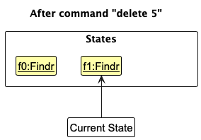
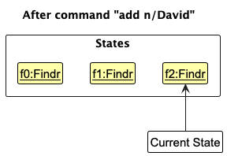
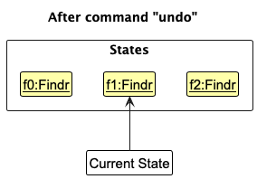
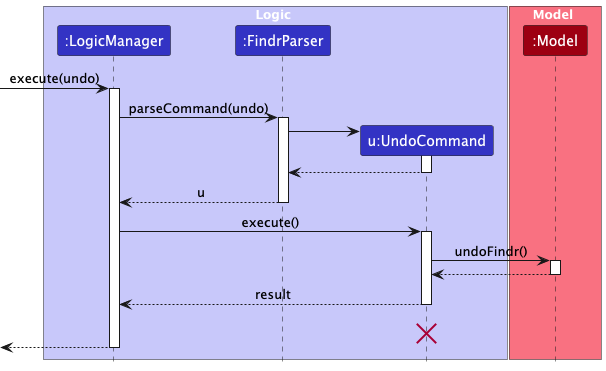
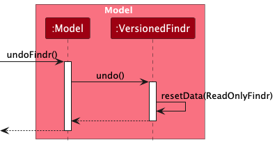
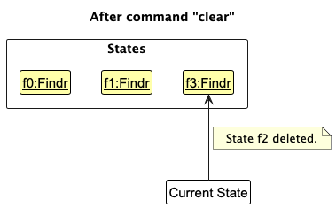

* Table of Contents
{:toc}

--------------------------------------------------------------------------------------------------------------------

## **Acknowledgements**

* {list here sources of all reused/adapted ideas, code, documentation, and third-party libraries -- include links to the original source as well}

--------------------------------------------------------------------------------------------------------------------

## **Setting up, getting started**

Refer to the guide [_Setting up and getting started_](SettingUp.md).

--------------------------------------------------------------------------------------------------------------------

## **Design**

:bulb: **Tip:** The `.puml` files used to create diagrams are in this document `docs/diagrams` folder. Refer to the [_PlantUML Tutorial_ at se-edu/guides](https://se-education.org/guides/tutorials/plantUml.html) to learn how to create and edit diagrams.

### Architecture

The ***Architecture Diagram*** given above explains the high-level design of the App.

Given below is a quick overview of main components and how they interact with each other.

**Main components of the architecture**

**`Main`** (consisting of classes [`Main`](https://github.com/se-edu/addressbook-level3/tree/master/src/main/java/seedu/address/Main.java) and [`MainApp`](https://github.com/se-edu/addressbook-level3/tree/master/src/main/java/seedu/address/MainApp.java)) is in charge of the app launch and shut down.
* At app launch, it initializes the other components in the correct sequence, and connects them up with each other.
* At shut down, it shuts down the other components and invokes cleanup methods where necessary.

The bulk of the app's work is done by the following four components:

* [**`UI`**](#ui-component): The UI of the App.
* [**`Logic`**](#logic-component): The command executor.
* [**`Model`**](#model-component): Holds the data of the App in memory.
* [**`Storage`**](#storage-component): Reads data from, and writes data to, the hard disk.

[**`Commons`**](#common-classes) represents a collection of classes used by multiple other components.

**How the architecture components interact with each other**

The *Sequence Diagram* below shows how the components interact with each other for the scenario where the user issues the command `delete 1`.

Each of the four main components (also shown in the diagram above),

* defines its *API* in an `interface` with the same name as the Component.
* implements its functionality using a concrete `{Component Name}Manager` class (which follows the corresponding API `interface` mentioned in the previous point.

For example, the `Logic` component defines its API in the `Logic.java` interface and implements its functionality using the `LogicManager.java` class which follows the `Logic` interface. Other components interact with a given component through its interface rather than the concrete class (reason: to prevent outside component's being coupled to the implementation of a component), as illustrated in the (partial) class diagram below.

The sections below give more details of each component.

### UI component

The **API** of this component is specified in [`Ui.java`](https://github.com/se-edu/addressbook-level3/tree/master/src/main/java/seedu/address/ui/Ui.java)

The UI consists of a `MainWindow` that is made up of parts e.g.`CommandBox`, `ResultDisplay`, `PersonListPanel`, `StatusBarFooter` etc. All these, including the `MainWindow`, inherit from the abstract `UiPart` class which captures the commonalities between classes that represent parts of the visible GUI.

The `UI` component uses the JavaFx UI framework. The layout of these UI parts are defined in matching `.fxml` files that are in the `src/main/resources/view` folder. For example, the layout of the [`MainWindow`](https://github.com/se-edu/addressbook-level3/tree/master/src/main/java/seedu/address/ui/MainWindow.java) is specified in [`MainWindow.fxml`](https://github.com/se-edu/addressbook-level3/tree/master/src/main/resources/view/MainWindow.fxml)

The `UI` component,

* executes user commands using the `Logic` component.
* listens for changes to `Model` data so that the UI can be updated with the modified data.
* keeps a reference to the `Logic` component, because the `UI` relies on the `Logic` to execute commands.
* depends on some classes in the `Model` component, as it displays `Person` object residing in the `Model`.

### Logic component

**API** : [`Logic.java`](https://github.com/se-edu/addressbook-level3/tree/master/src/main/java/seedu/address/logic/Logic.java)

Here's a (partial) class diagram of the `Logic` component:

The sequence diagram below illustrates the interactions within the `Logic` component, taking `execute("delete 1")` API call as an example.

:information_source: **Note:** The lifeline for `DeleteCommandParser` should end at the destroy marker (X) but due to a limitation of PlantUML, the lifeline continues till the end of diagram.

How the `Logic` component works:

1. When `Logic` is called upon to execute a command, it is passed to a `FindrParser` object which in turn creates a parser that matches the command (e.g., `DeleteCommandParser`) and uses it to parse the command.
1. This results in a `Command` object (more precisely, an object of one of its subclasses e.g., `DeleteCommand`) which is executed by the `LogicManager`.
1. The command can communicate with the `Model` when it is executed (e.g. to delete a person). 
   Note that although this is shown as a single step in the diagram above (for simplicity), in the code it can take several interactions (between the command object and the `Model`) to achieve.
1. The result of the command execution is encapsulated as a `CommandResult` object which is returned back from `Logic`.

Here are the other classes in `Logic` (omitted from the class diagram above) that are used for parsing a user command:

How the parsing works:
* When called upon to parse a user command, the `FindrParser` class creates an `XYZCommandParser` (`XYZ` is a placeholder for the specific command name e.g., `AddCommandParser`) which uses the other classes shown above to parse the user command and create a `XYZCommand` object (e.g., `AddCommand`) which the `FindrParser` returns back as a `Command` object.
* All `XYZCommandParser` classes (e.g., `AddCommandParser`, `DeleteCommandParser`, ...) inherit from the `Parser` interface so that they can be treated similarly where possible e.g, during testing.

### Model component
**API** : [`Model.java`](https://github.com/se-edu/addressbook-level3/tree/master/src/main/java/seedu/address/model/Model.java)

The `Model` component,

* stores the findr data i.e., all `Person` objects (which are contained in a `UniquePersonList` object).
* stores the currently 'selected' `Person` objects (e.g., results of a search query) as a separate _filtered and sorted_ list which is exposed to outsiders as an unmodifiable `ObservableList<Person>` that can be 'observed' e.g. the UI can be bound to this list so that the UI automatically updates when the data in the list change.
* stores a `UserPref` object that represents the user’s preferences. This is exposed to the outside as a `ReadOnlyUserPref` objects.
* does not depend on any of the other three components (as the `Model` represents data entities of the domain, they should make sense on their own without depending on other components)

:information_source: **Note:** An alternative (arguably, a more OOP) model is given below. It has a `Tag` list in the `Findr`, which `Person` references. This allows `Findr` to only require one `Tag` object per unique tag, instead of each `Person` needing their own `Tag` objects. 

### Storage component

**API** : [`Storage.java`](https://github.com/se-edu/addressbook-level3/tree/master/src/main/java/seedu/address/storage/Storage.java)

The `Storage` component,
* can save both findr data and user preference data in JSON format, and read them back into corresponding objects.
* inherits from both `FindrStorage` and `UserPrefStorage`, which means it can be treated as either one (if only the functionality of only one is needed).
* depends on some classes in the `Model` component (because the `Storage` component's job is to save/retrieve objects that belong to the `Model`)

### Common classes

Classes used by multiple components are in the `seedu.address.commons` package.

--------------------------------------------------------------------------------------------------------------------

## **Implementation**

This section describes some noteworthy details on how certain features are implemented.

### \[Proposed\] Undo/redo feature

#### Proposed Implementation

The proposed undo/redo mechanism is facilitated by `VersionedFindr`. It extends `Findr` with an undo/redo history, stored internally as a `findrStateList` and `currentStatePointer`. Additionally, it implements the following operations:

* `VersionedFindr#commit()` — Saves the current findr state in its history.
* `VersionedFindr#undo()` — Restores the previous findr state from its history.
* `VersionedFindr#redo()` — Restores a previously undone findr state from its history.

These operations are exposed in the `Model` interface as `Model#commitFindr()`, `Model#undoFindr()` and `Model#redoFindr()` respectively.

Given below is an example usage scenario and how the undo/redo mechanism behaves at each step.

Step 1. The user launches the application for the first time. The `VersionedFindr` will be initialized with the initial findr state, and the `currentStatePointer` pointing to that single findr state.

Step 2. The user executes `delete 5` command to delete the 5th person in findr. The `delete` command calls `Model#commitFindr()`, causing the modified state of findr after the `delete 5` command executes to be saved in the `findrStateList`, and the `currentStatePointer` is shifted to the newly inserted findr state.

Step 3. The user executes `add n/David …​` to add a new person. The `add` command also calls `Model#commitFindr()`, causing another modified findr state to be saved into the `findrStateList`.

:information_source: **Note:** If a command fails its execution, it will not call `Model#commitFindr()`, so the findr state will not be saved into the `findrStateList`.

Step 4. The user now decides that adding the person was a mistake, and decides to undo that action by executing the `undo` command. The `undo` command will call `Model#undoFindr()`, which will shift the `currentStatePointer` once to the left, pointing it to the previous findr state, and restores findr to that state.

:information_source: **Note:** If the `currentStatePointer` is at index 0, pointing to the initial findr state, then there are no previous findr states to restore. The `undo` command uses `Model#canUndoFindr()` to check if this is the case. If so, it will return an error to the user rather
than attempting to perform the undo.

The following sequence diagram shows how an undo operation goes through the `Logic` component:

:information_source: **Note:** The lifeline for `UndoCommand` should end at the destroy marker (X) but due to a limitation of PlantUML, the lifeline reaches the end of diagram.

Similarly, how an undo operation goes through the `Model` component is shown below:

The `redo` command does the opposite — it calls `Model#redoFindr()`, which shifts the `currentStatePointer` once to the right, pointing to the previously undone state, and restores findr to that state.

:information_source: **Note:** If the `currentStatePointer` is at index `findrStateList.size() - 1`, pointing to the latest findr state, then there are no undone findr states to restore. The `redo` command uses `Model#canRedoFindr()` to check if this is the case. If so, it will return an error to the user rather than attempting to perform the redo.

Step 5. The user then decides to execute the command `list`. Commands that do not modify findr, such as `list`, will usually not call `Model#commitFindr()`, `Model#undoFindr()` or `Model#redoFindr()`. Thus, the `findrStateList` remains unchanged.

Step 6. The user executes `clear`, which calls `Model#commitFindr()`. Since the `currentStatePointer` is not pointing at the end of the `findrStateList`, all findr states after the `currentStatePointer` will be purged. Reason: It no longer makes sense to redo the `add n/David …​` command. This is the behavior that most modern desktop applications follow.

The following activity diagram summarizes what happens when a user executes a new command:

#### Design considerations:

**Aspect: How undo & redo executes:**

* **Alternative 1 (current choice):** Saves the entire findr.
  * Pros: Easy to implement.
  * Cons: May have performance issues in terms of memory usage.

* **Alternative 2:** Individual command knows how to undo/redo by
  itself.
  * Pros: Will use less memory (e.g. for `delete`, just save the person being deleted).
  * Cons: We must ensure that the implementation of each individual command are correct.

_{more aspects and alternatives to be added}_

### \[Proposed\] Advanced candidate search and filtering

#### Proposed Implementation

The proposed advanced search mechanism is facilitated by `AdvancedSearchManager`. 
It extends findr with advanced filtering capabilities, stored internally as a
`searchPredicateStack` and `currentSearchPredicate`. Additionally, it implements
the following operations:

* `AdvancedSearchManager#compilePredicate()` - Compiles multiple search criteria into a single executable predicate.
* `AdvancedSearchManager#saveFilter()` - Stores the current search filter for future reuse.
* `AdvancedSearchManager#loadFilter()` - Retrieves a previously saved search filter.

These operations are exposed in the Model interface as `Model#compileSearchPredicate()`,
`Model#saveSearchFilter()` and `Model#loadSearchFilter()` respectively.

Given below is an example usage scenario and how the advanced search mechanism behaves at each step.

**Step 1**. The user launches the application and wants to find senior backend developers.
The `AdvancedSearchManager` will be initialized with an empty search predicate stack.

**Step 2**. The user executes `filter tn/Java tn/Spring r/Good-Excellent yoe/5-10` to find 
candidates with Java and Spring tags, rated Good to Excellent, with 5-10 years
experience. The filter command calls `Model#compileSearchPredicate()`, causing
the search criteria to be compiled into a composite predicate, and the candidate 
list is filtered to show only matching candidates.

**Step 3**. The user realizes they also want to filter by location and 
executes `filter loc/Singapore sal/80000-120000`. The filter command calls 
`Model#compileSearchPredicate()` again, combining the new criteria with 
the existing ones, and updates the filtered candidate list.

**:information_source: Note:** If the search criteria are invalid (e.g., 
malformed ranges), the command will not call `Model#compileSearchPredicate()`,
so the filter state will not be updated.

**Step 4**. The user now decides this is a useful filter combination and wants 
to save it by executing `filter save/senior-backend-sg`. The save command calls
`Model#saveSearchFilter()`, which stores the current predicate configuration as
"senior-backend-sg" for future use.

:information_source: Note: If a filter with the same name already exists, the save
operation will overwrite it. The command uses `Model#isValidFilterName()` to check 
if the name is valid. If not, it will return an error to the user.

**Step 5**. The user clears the current filter with filter clear and works 
with other candidates. Later, they want to reuse the saved filter and execute
`filter use/senior-backend-sg`. The use command calls `Model#loadSearchFilter()`, 
which retrieves the saved predicate and applies it to the current candidate 
list.

**Step 6**. The user executes `list` to view all candidates again. The list 
command clears any active filters and displays the full candidate database.

:information_source: Note: Non-filtering commands like `list` and `help` do not 
affect the search predicate stack, allowing users to return to their filtered 
view after performing other operations.

**Step 7**. The user executes a new filter command with different criteria. 
Since the search predicate stack maintains the current active filter, applying
a new filter replaces the current one rather than accumulating criteria.

:information_source: Note: This behavior follows the principle of least surprise, 
where each filter command represents a complete new query rather than incremental 
additions to the previous filter.

#### Design Considerations

**Aspect: How search predicates are combined:**

* **Alternative 1 (current choice):** Each filter command represents a complete new query

    * Pros: Predictable behavior, easy to understand and matches mental model of search queries
    * Cons: Cannot incrementally add/remove criteria from current filter

* **Alternative 2:** Filter commands modify current predicate incrementally

    * Pros: More flexible for refining searches, preserves work in complex filtering
    * Cons: Complex implementation, unpredictable behavior for users and harder to manage predicate state

**Aspect: How complex boolean logic is handled:**

* **Alternative 1 (current choice):** Implicit AND between criteria with explicit OR groups

    * Pros: Intuitive for most users, covers 90% of use cases, simple syntax
    * Cons: Limited expressiveness for complex boolean logic

* **Alternative 2**: Full boolean expression parser

    * Pros: Maximum flexibility for power users and can express any logical combination
    * Cons: Complex syntax, steep learning curve and difficult to parse and validate

**Aspect: Filter persistence strategy:**

* **Alternative 1 (current choice):** Saved filters stored in separate configuration file

    * Pros: Easy to back up and share filters which are separate from main data file
    * Cons: Additional files to manage and potential sync issues

* **Alternative 2:** Saved filters embedded in main data file 
  * Pros: Single file management and automatic inclusion in backups
  * Cons: Bloat main data file and also harder to export/import just filters

--------------------------------------------------------------------------------------------------------------------

## **Documentation, logging, testing, configuration, dev-ops**

* [Documentation guide](Documentation.md)
* [Testing guide](Testing.md)
* [Logging guide](Logging.md)
* [Configuration guide](Configuration.md)
* [DevOps guide](DevOps.md)

--------------------------------------------------------------------------------------------------------------------

## **Appendix: Requirements**

### Product scope

**Target user profile**:

* tech firm recruiters
* has a need to manage a significant number of contacts
* prefer desktop apps over other types
* can type fast
* prefers typing to mouse interactions
* is reasonably comfortable using CLI apps

**Value proposition**: findr aims to equip recruiters with a one-stop solution for tech talent.
Our platform centralizes candidate data, streamlines communication, and provides analytics to help you identify,
assess, and engage top-tier candidates. Go beyond the resume to find the perfect fit.

### User stories

Priorities: High (must have) - `* * *`, Medium (nice to have) - `* *`, Low (unlikely to have) - `*`

| Priority | As a …​                          | I want to …​                                 | So that I can…​                                                        |
|----------|----------------------------------|----------------------------------------------|------------------------------------------------------------------------|
| `* * *`  | new recruiter                    | see usage instructions                       | refer to instructions when I forget how to use the App                 |
| `* * *`  | recruiter                        | add a potential candidate                    | keep track of all possible candidates                                  |
| `* * *`  | recruiter                        | delete candidates I am no longer considering | reduce clutter on my contacts list                                     |
| `* * *`  | recruiter                        | find a candidate by name                     | locate details of persons without having to go through the entire list |
| `* * *`  | recruiter                        | see all candidates in the list               | view all candidates conveniently                                       |
| `* *`    | recruiter                        | autosave my changes                          | not lose my work accidentally                                          |
| `* *`    | recruiter with many candidates   | sort candidates by name                      | locate a person easily                                                 |
| `* *`    | recruiter with many candidates   | sort candidates by date added                | locate a person easily                                                 |
| `* *`    | recruiter with many candidates   | sort candidates by rating                    | locate a person easily                                                 |

*{More to be added}*

### Use cases

(For all use cases below, the **System** is `findr` and the **Actor** is the `Recruiter`, unless specified otherwise)

**Use case: View-all candidates**

**MSS**
1. Actor requests to view all candidates.
2. System displays the full candidate list with key fields (name, role, status, tags).

   Use case ends.

**Extensions**
* 1a. The candidate list is empty.

  Use case ends.

---

**Use case: Add a candidate**

**MSS**
1. Actor chooses to add a candidate.
2. System requests the candidate details (e.g., name, role, contact, tags).
3. Actor enters required details.
4. System validates and creates the candidate.
5. System shows the updated list including the new candidate.

   Use case ends.

**Extensions**
* 3a. Required details are missing or invalid.

  3a1. System highlights invalid fields and requests corrections.

  3a2. Actor provides corrected data.

  Steps 3a1–3a2 repeat until data are valid. Use case resumes from step 4.

* 4a. Duplicate candidate (e.g., same email) detected.

  4a1. System shows a duplicate warning and suggests viewing the existing record.

  4a2. Actor chooses to cancel or proceed with an override if allowed by policy.

  Use case resumes from step 5 (if created) or ends (if cancelled).

---

**Use case: Delete a candidate**

**MSS**
1. Actor requests to delete a specific candidate from the current list or from a specific kanban stage.
2. System validates the index and optional stage parameter.
3. Actor deletes the candidate and updates the list.
4. System shows a success message with the deleted candidate's details.

   Use case ends.

**Extensions**
* 1a. The given index is invalid for the displayed list or specified stage.

  1a1. System shows an error message indicating invalid index.

  Use case resumes at step 1.

* 1b. A stage is specified but the stage name is invalid.

  1b1. System shows an error message with valid stage names (Candidates, Contacted, Interviewed, Hired).

  Use case resumes at step 1.

* 1c. The specified stage has no candidates.

  1c1. System shows an error message indicating the stage is empty or index is out of bounds.

  Use case resumes at step 1.

---

**Use case: Move a candidate between recruitment stages**

**MSS**
1. Actor identifies a candidate in one stage and specifies the new stage to move them to.
2. System validates the move request (index and stage names).
3. System updates the candidate's stage and reflects the change in the kanban board view.
4. System shows a success message with the candidate's name and the stage transition.

   Use case ends.

**Extensions**
* 1a. The given index is invalid for the specified source stage.

  1a1. System shows an error message indicating invalid index.

  Use case resumes at step 1.

* 1b. The stage name is invalid or misspelled.

  1b1. System shows an error message with valid stage names.

  Use case resumes at step 1.

* 2a. Source stage and destination stage are the same.

  2a1. System shows an error message that the candidate is already in the specified stage.

  Use case resumes at step 1.

* 2b. The specified source stage has no candidates.

  2b1. System shows an error message indicating the stage is empty.

  Use case resumes at step 1.

---

**Use case: Sort candidates by sort criteria**

**MSS**
1. Actor requests to sort candidate list by sort criteria. 
2. System validates the sort request (sort criteria).
3. System updates the candidate list and reflects the change in the kanban board view. 
4. System shows a success message.

   Use case ends.

**Extensions**
* 1a. The specified sort criteria is invalid.

  1a1. System shows an error message with valid sort criteria.

  Use case resumes at step 1.

---

**Use case: Auto-save changes**

**MSS**
1. Actor performs a change (e.g., add, delete, edit).
2. System automatically persists the change to storage.
3. System shows a brief "Saved" status.

   Use case ends.

**Extensions**
* 2a. Temporary storage failure (e.g., file lock, I/O error).

  2a1. System queues a retry and shows a non-intrusive warning.

  2a2. If retry succeeds, System shows "Saved" and logs the event.

  2a3. If retry fails after N attempts, System prompts the recruiter to "Retry now" or "Save As…".

  Use case ends.

* 2b. Storage is unavailable (e.g., permission denied).

  2b1. System prevents further destructive actions and displays recovery guidance.

  Use case ends.

### Non-Functional Requirements

1.  Should work on any _mainstream OS_ as long as it has Java `17` or above installed.
2.  Should be able to hold up to 1000 persons without a noticeable sluggishness in performance for typical usage.
3.  A user with above average typing speed for regular English text (i.e. not code, not system admin commands) should be able to accomplish most of the tasks faster using commands than using the mouse.
4.  The UI should be intuitive enough for basic use without training.
5.  Data must save automatically after each change to prevent data loss.
6.  The codebase must be well-documented and adhere to coding standards.

*{More to be added}*

### Glossary

* **Actor**: A role (e.g., recruiter, user) interacting with the system in a use case.
* **Private contact detail**: A contact detail that is not meant to be shared with others
* **Auto-save**: A system feature that automatically persists changes without explicit user action.
* **Candidate**: A person added to the system by a recruiter as a potential hire.
* **Mainstream OS**: Windows, Linux, Unix, MacOS (as stated in non-functional requirements).
* **Override**: An action that allows bypassing system warnings (e.g., creating a candidate despite duplicates).
* **Recruiter**: The primary user of findr who manages and tracks potential candidates.
* **System**: Refers to the findr application in use cases.
* **Tag**: A keyword or label assigned to a candidate (e.g., “Java,” “Frontend”) to aid categorization and search.

--------------------------------------------------------------------------------------------------------------------

## **Appendix: Instructions for manual testing**

Given below are instructions to test the app manually.

:information_source: **Note:** These instructions only provide a starting point for testers to work on;
testers are expected to do more *exploratory* testing.

### Launch and shutdown

1. Initial launch

   1. Download the jar file and copy into an empty folder

   1. Double-click the jar file Expected: Shows the GUI with a set of sample contacts. The window size may not be optimum.

1. Saving window preferences

   1. Resize the window to an optimum size. Move the window to a different location. Close the window.

   1. Re-launch the app by double-clicking the jar file. 
       Expected: The most recent window size and location is retained.

1. _{ more test cases …​ }_

### Deleting a person

1. Deleting a person while all persons are being shown

   1. Prerequisites: List all persons using the `list` command. Multiple persons in the list.

   1. Test case: `delete 1` 
      Expected: First contact is deleted from the list. Details of the deleted contact shown in the status message. Timestamp in the status bar is updated.

   1. Test case: `delete 0` 
      Expected: No person is deleted. Error details shown in the status message. Status bar remains the same.

   1. Other incorrect delete commands to try: `delete`, `delete x`, `...` (where x is larger than the list size) 
      Expected: Similar to previous.

1. _{ more test cases …​ }_

### Saving data

1. Dealing with missing/corrupted data files

   1. _{explain how to simulate a missing/corrupted file, and the expected behavior}_

1. _{ more test cases …​ }_
